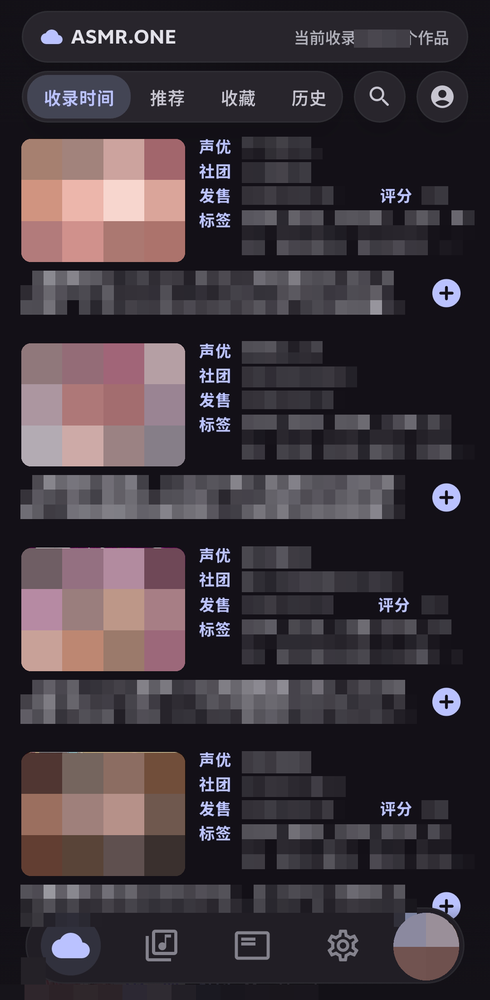
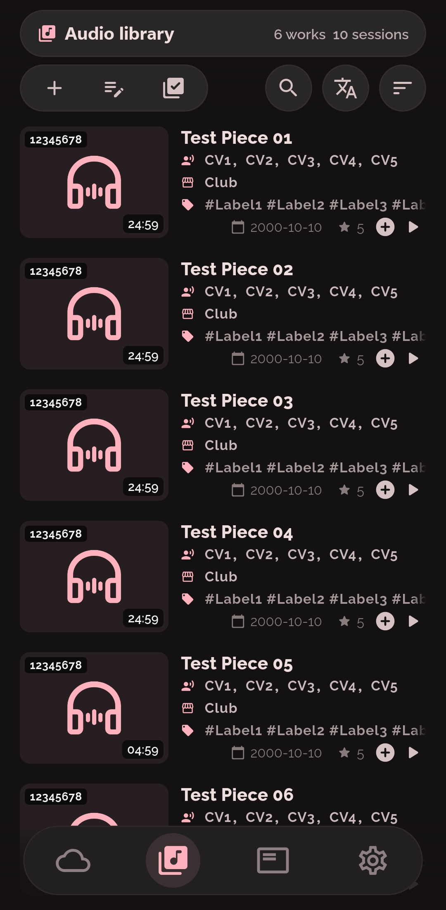
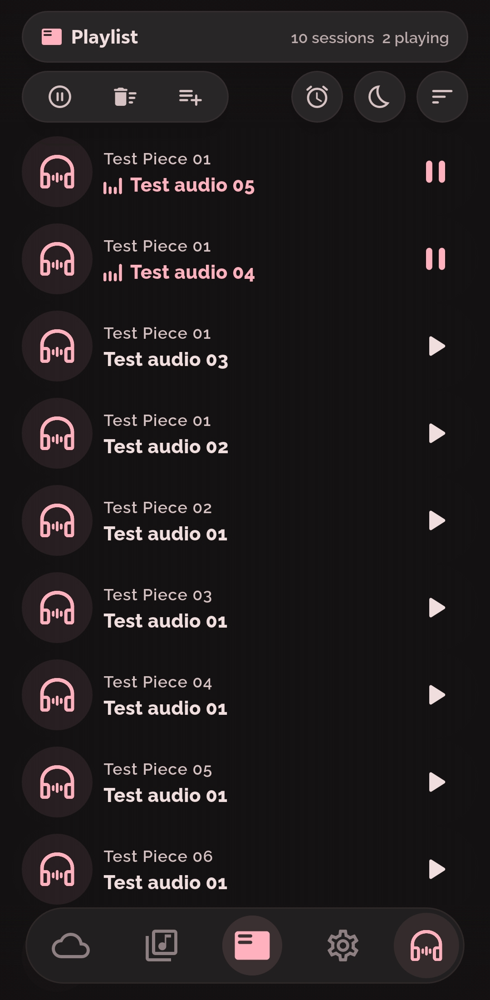
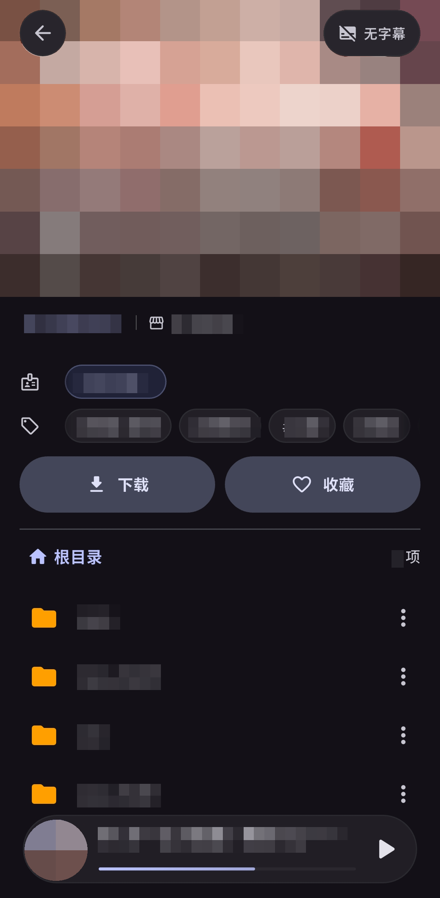
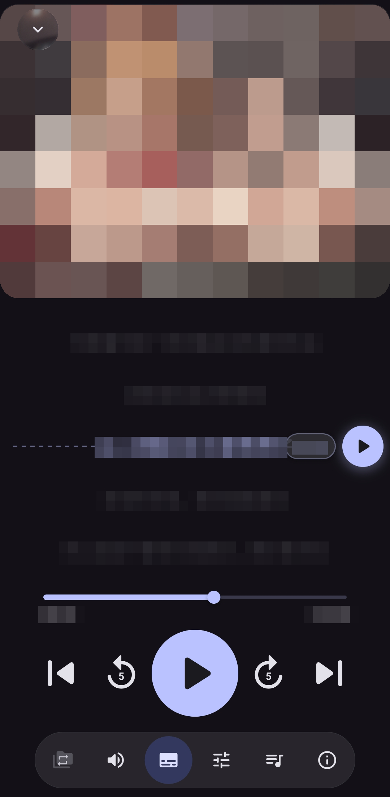

<p align="center">
  
</p>

# Doujin Audio

简体中文 | [English](README.en.md) | [日本語](README.ja.md)

面向 ASMR、同人音声与本地媒体库的 Android / Windows 播放器。支持本地音视频、ASMR.ONE 在线播放与下载，可同时管理多个播放会话，独立设置进度、音量、字幕和音效。

[下载安装](https://github.com/NameIess-art/Doujin-Audio/releases/latest) · [更新记录](release_notes.md) · [GPL-3.0](LICENSE) · [隐私说明](PRIVACY.md) · [安全说明](SECURITY.md)

[下载与安装](#下载与安装) · [应用截图](#应用截图) · [主要功能](#主要功能) · [Windows 使用说明](#windows-使用说明) · [开发与发布](#开发与发布)

## 下载与安装

从 [GitHub Latest Release](https://github.com/NameIess-art/Doujin-Audio/releases/latest) 下载安装包。Android 不确定设备架构时可选择 universal；Windows 支持 Windows 10/11 x64，运行依赖随包提供。每个安装包均附带同名 `.sha256` 校验文件。

| 平台 | 安装包 | 适用设备 |
| --- | --- | --- |
| Android universal | `DoujinAudio-android-universal-<tag>.apk` | 包含 arm64-v8a、armeabi-v7a、x86_64，适合不确定架构的用户 |
| Android arm64-v8a | `DoujinAudio-android-arm64-<tag>.apk` | 大多数现代 64 位 Android 设备，体积更小 |
| Android armeabi-v7a | `DoujinAudio-android-armv7-<tag>.apk` | 旧款 32 位 ARM Android 设备 |
| Android x86_64 | `DoujinAudio-android-x64-<tag>.apk` | x86_64 平板、模拟器及兼容设备 |
| Windows x64 | `DoujinAudio-windows-x64-<tag>-setup.exe` | Windows 10/11，当前用户安装 |

对应的 SHA256 校验文件：

```text
DoujinAudio-android-universal-<tag>.apk.sha256
DoujinAudio-android-arm64-<tag>.apk.sha256
DoujinAudio-android-armv7-<tag>.apk.sha256
DoujinAudio-android-x64-<tag>.apk.sha256
DoujinAudio-windows-x64-<tag>-setup.exe.sha256
```

官方仅通过 GitHub Release 分发，不提供应用商店 AAB 或 iOS 版本。当前版本以 [`pubspec.yaml`](pubspec.yaml) 为准。

> **旧版本升级：**当前 Android 应用 ID 为 `com.doujin.audio`，作为独立应用安装，不能覆盖更名前的版本，也不会继承其私有数据。`.dabackup` 恢复要求平台和格式兼容，备份数据库版本不得高于应用支持的版本；不自动迁移更名前的数据或旧备份格式。

### 第一次使用

1. 安装对应平台的安装包。Android 如提示安装受限，请允许打开 APK 的浏览器或文件管理器安装未知应用；Windows 按安装向导完成当前用户安装。
2. 在“本地音频库”添加媒体目录、子文件夹或单个文件。Android 通过 SAF 系统选择器授权，Windows 选择本地文件夹。
3. 点击作品进入详情，点击音频或视频条目开始播放；也可在 ASMR.ONE 浏览在线资源，账号功能需登录。
4. Android 卡片支持滑动快捷操作，Windows 使用右键菜单。Windows 关闭主窗口后仍在托盘运行，结束播放并退出时请选择托盘“退出”。

## 应用截图

<table>
  <tr>
    <td colspan="2" align="center"><strong>ASMR.ONE</strong><br></td>
    <td colspan="2" align="center"><strong>本地音频库</strong><br></td>
    <td colspan="2" align="center"><strong>播放列表</strong><br></td>
  </tr>
  <tr>
    <td colspan="3" align="center"><strong>作品详细信息</strong><br></td>
    <td colspan="3" align="center"><strong>播放详情</strong><br></td>
  </tr>
</table>

## 主要功能

### 播放与音效

- **多会话与自定义队列**：同时保留多个独立会话，分别记录音轨、进度、音量、循环模式、字幕与音效。队列可命名、排序、拖动重排和自定义配色，支持批量暂停、恢复与移除。
- **六种播放模式**：单曲循环、当前文件夹顺序或随机、跨文件夹顺序或随机、播完单曲后停止。移除队列中的当前曲目后，音频继续播放至结束或手动切歌。
- **播放控制**：播放 / 暂停、上一曲 / 下一曲、快进 / 快退、精细进度调节与失败重试，加载和缓冲时显示状态反馈。
- **音频调节**：EQ 预设与频段增益、跳过静音、轻度降噪、动态音量平衡、左右声道互换与平衡；支持保持音高的 0.25x–3.0x 变速。Android 使用原生 EQ，Windows 使用软件 EQ。
- **时间轴标记**：为时间点或片段添加名称和颜色，设置区间循环；标记可随本地元数据和备份保存。
- **视频播放**：在播放详情页查看视频，支持全屏、息屏音频播放及“仅播放音频”模式。

### 字幕与台本

- 自动匹配同名字幕或手动关联，支持 `.srt`、`.ass`、`.ssa`、`.vtt`、`.lrc`。播放详情、迷你播放条与系统悬浮窗同步显示，支持时间偏移调节、全文时间轴浏览与点击定位。
- 悬浮字幕可拖动，并自定义字体、大小、颜色、背景透明度及描边；Android 需悬浮窗权限，Windows 使用独立置顶窗口。
- 导入本地字幕时，将所选文件重命名并移动到音频同目录；已有字幕时确认是否覆盖，取消则保留原文件。编辑功能支持逐条修改文字和起止时间，按原格式写回关联文件，兼容 Android SAF。
- 手动选择 `.txt` / `.md` 日语台本，匹配音频并生成 `.lrc` 时间轴；含有效时间轴的 `.txt` 可直接导入。日语字幕通过 Google 公共在线接口翻译为中文或英文，不再下载或使用本地翻译模型，保留时间轴并保存为“原文＋译文”的 SRT。
- 每次翻译单独保存为 `<完整音频文件名>.translated.<目标语言>.srt`（中文为 `zh-CN`，英文为 `en`），重名时添加 `.2`、`.3` 等序号，原字幕和其他译文不变。字幕菜单的“选择字幕”可切换原字幕与各版译文，并记住每个音频的选择；翻译成功后自动启用新译文。
- 字幕翻译明确指定日语源语言，保留多行原文；单条字幕在请求长度限制内作为完整文本翻译。新译文 SRT 带有不参与本应用字幕显示的原文边界标记，重新翻译时只处理原文，不重复翻译旧译文。编辑新生成的双语字幕时，原文和译文分开修改，保留原文边界。
- 识别与翻译结果保存在本地音频同目录；在线音频的结果保存在应用数据目录。台本识别首次使用会下载并校验本地 CTC 模型，任务支持后台处理、查看进度和中断续接。**32 位 Android 暂不支持台本识别，但支持在线字幕翻译。** 字幕翻译会将原文发送至 Google，需联网，可用性受网络、限流和服务调整影响；失败或取消不会覆盖字幕。

### 本地媒体库

- **目录与分类**：保留文件夹层级，支持声优、标签、时长、发售日期、添加时间和标题等分类与排序，以及多关键词搜索、置顶、拖动排序和批量添加队列。
- **目录授权**：Android 使用 SAF 持久授权，也支持直接路径扫描与单文件导入；Windows 使用本地文件夹。扫描按批次更新媒体库。
- **封面管理**：从目录图片、音频内嵌图像或视频帧提取封面，可优先使用文件自身封面，也可手动选择；重复内嵌封面去重，支持 WAV APIC 封面。
- **作品附件**：在详情页浏览 `.txt`、`.md`、`.pdf` 台本与文档；文本支持编码探测，PDF 支持分页预览。
- **页面翻译**：本地与 ASMR.ONE 作品详情页右上角可翻译标题、社团、标签及目录和文件名；文本查看页右上角可翻译已加载的 TXT 与 Markdown 正文，保留 Markdown 排版、链接和代码，PDF 不支持翻译。目标语言跟随应用语言，再次点击恢复原文，处理中可取消。仅改变显示，不改写作品信息、路径或源文件。使用无需 API Key 的 Google 公共在线接口，待翻译文本会发送至 Google，可用性受网络、限流和服务调整影响。
- **DLsite 元数据**：通过 RJ 编号、文件名或标题检索作品信息，支持批量匹配、逐部审查、编辑后确认保存。带 RJ 编号的本地作品可直达 ASMR.ONE 下载页，将文件补充到当前作品目录。
- **移出与恢复**：移出媒体库时提供撤销操作，已移出的目录会在后续扫描中忽略，也可从“已移除目录”恢复。

作品信息使用目录内的 `doujin-audio.json` 保存，包含选定封面、时间轴标记和片段循环。扫描导入与 RJ 编号补全不改写已有 JSON；自动补齐时长只更新空白时长，保留其他字段和条目，文件不可读或格式不兼容时保留原文件。目录作品的标记使用轨道相对路径，便于移动后恢复；重复导入保留较新的标记。

### ASMR.ONE 与下载

- 浏览最新收录、推荐、标签与声优分类，登录后同步收藏和播放历史；支持在线播放、添加队列和播放后自动缓存。
- 下载单曲、子文件夹或整个作品，保留原目录结构，封面另存至 `Cover/<RJ号>.<扩展名>`。Android 使用 SAF 下载目录，Windows 使用本地文件夹。
- 支持单任务或全局暂停、断点续传与失败重试。可设置同时下载 1–5 部作品，重试上限 3–10 次（默认 5 次）；退至后台或退出前挂起任务，恢复后继续传输。
- 作品完整下载后自动刷新已添加的媒体库；**下载目录不会自动加入媒体库**，库外作品仍需手动导入。已有 JSON 保持不变，仅在完整下载成功且元数据有效时生成新的 JSON。

### 定时与后台播放

- 设置倒计时或播完当前曲目后停止，支持停止前淡出、预设时间自动恢复及恢复时淡入。
- Android 使用原生前台媒体服务维持后台与息屏播放，通知仅显示应用名和服务运行提示；支持异常重试及未完成定时任务的重启恢复。
- Android 的 Doze 和厂商后台限制仍可能影响长时播放，可在“权限与后台”检查电池优化和后台权限。唤醒锁不能绕过系统限制。
- Windows 使用当前用户的任务计划恢复未完成定时任务。睡眠唤醒取决于硬件与电源策略，**不支持关机唤醒或未登录时播放**。

### 个性化与数据维护

- 浅色、深色或跟随系统主题，自选主题色、ASMR.ONE 独立配色、启动页面、转场速度、减少动画与封面解码质量；界面支持简体中文、英语和日语。
- Android 可调整耳机断开、短暂焦点丢失与通话结束后的行为，并选择独占焦点或与其他应用混音。
- `.dabackup` 备份媒体库、设置、播放历史与会话、时间轴标记及 ASMR.ONE 凭据。恢复前校验，在下次冷启动替换数据，失败时回滚；**仅支持同平台恢复**。
- 封面持久缓存支持重启后或离线读取，不按时间或容量自动淘汰。列表、筛选、分页与浏览位置仅在当前运行期间保留，详情重新打开时加载文件树。
- Android 提供存储分析和分类缓存清理；Windows 隐藏“权限与后台”“缓存”“存储空间”等手机专属设置，内部缓存仍服务于播放和下载。清理保留用户源文件、手选封面、收藏、历史及播放状态。
- 导出移除敏感账号信息的诊断报告，便于提交故障反馈。
- 视频转音频支持 MP3、AAC、OGG、WAV、FLAC，提供码率选择、转换进度与取消，完成后可加入媒体库。

## 支持格式

| 类型 | 格式 |
| --- | --- |
| 音频 | `flac`、`wav`、`mp3`、`m4a`、`aac`、`ogg`、`opus`、`3gp` |
| 视频 | `mp4`、`mkv`、`webm`、`mov`、`m4v`、`avi`、`3gp` |
| 字幕 | `.srt`、`.ass`、`.ssa`、`.vtt`、`.lrc` |
| 文档 | `.txt`（编码探测）、`.md`、`.pdf` |
| 封面 | `jpg`、`jpeg`、`png`、`webp`、音频内嵌图像、视频帧 |
| 备份 | `.dabackup` |

## Windows 使用说明

主界面采用横向布局，默认客户区 1280×800、最小 960×600 逻辑像素，支持调整窗口大小与最大化。卡片通过右键菜单操作，元数据标签通过右键复制，纵向页面提供常显滚动条。悬浮字幕在主窗口前台与后台均显示，可拖动、调整宽度，并按文字换行和调整高度。

关闭主窗口进入托盘；托盘“退出”会保存数据并结束进程。应用提供单实例、系统媒体控制、音频输出设备变更处理和任务栏缩略图播放按钮。升级保留用户数据，卸载清理定时任务但保留用户数据目录。

按 `F1` 查看键盘帮助和全局快捷键注册状态：

| 范围 | 按键 | 操作 |
| --- | --- | --- |
| 系统全局（含后台与托盘） | `Ctrl+Alt+Space` | 播放 / 暂停 |
| 系统全局 | `Ctrl+Alt+←` / `→` | 上一曲 / 下一曲 |
| 系统全局 | `Ctrl+Alt+↑` | 恢复主窗口 |
| 应用前台 | `Ctrl+Space` | 播放 / 暂停 |
| 应用前台 | `Ctrl+←` / `→` | 上一曲 / 下一曲 |
| 应用前台 | `Alt+←` / `→` | 后退 / 前进 5 秒 |
| 应用前台 | `Alt+↑` / `↓` | 当前控制会话音量增加 / 减少 5% |
| 主界面 | `Ctrl+1` 至 `Ctrl+4` | 按显示顺序切换导航页面 |
| 主界面 | `Ctrl+Tab` / `Ctrl+Shift+Tab` | 下一页 / 上一页 |
| 控件与菜单 | `Tab` / `Shift+Tab`、`Enter` | 移动焦点并激活控件 |
| 卡片 | `Shift+F10` 或菜单键 | 打开操作菜单 |
| 菜单与页面 | `↑` / `↓`、`Esc` | 选择菜单项、关闭菜单或返回 |

输入文本时保留编辑按键；空格优先激活已聚焦按钮，未被控件使用时控制播放。全局快捷键被其他程序占用时，帮助中会显示不可用。播放控制与系统媒体控制使用同一个会话选择规则。

## 应用内更新与隐私

应用在启动时或设置页手动检查 GitHub Latest Release，按平台与 CPU 架构选择安装包，展示下载进度，并在 **SHA-256 校验通过后**启动 Android 系统安装器或 Windows 安装向导。Android 无法判断架构时选择 universal，Windows 选择 x64 安装包。

媒体库索引、设置和播放状态保存在设备本地。网络用于 ASMR.ONE、DLsite 元数据、GitHub 更新、台本识别模型的首次下载，以及用户主动发起的页面和字幕翻译；在线字幕先缓存为本地文件再读取。文件访问、悬浮窗等权限在使用对应功能时申请，详情参见 [隐私说明](PRIVACY.md)。

### Android 权限

| 权限 | 用途 |
| --- | --- |
| `READ_MEDIA_AUDIO` / `READ_EXTERNAL_STORAGE` | 直接文件系统扫描与传统文件选择 |
| `MANAGE_EXTERNAL_STORAGE` | 可选的完整存储访问，使用 SAF 时无需此权限 |
| `FOREGROUND_SERVICE_MEDIA_PLAYBACK` / `WAKE_LOCK` | 后台与息屏播放 |
| `SYSTEM_ALERT_WINDOW` | 系统悬浮字幕 |
| `SCHEDULE_EXACT_ALARM` / `RECEIVE_BOOT_COMPLETED` | 精确定时与重启后任务恢复 |
| `REQUEST_INSTALL_PACKAGES` | 下载更新后调用系统安装器 |
| `INTERNET` | 在线资源、元数据查询与更新 |

## 开发与发布

共享界面和业务逻辑使用 Flutter，Android 播放核心为 Media3 / ExoPlayer，Windows 为 media_kit / libmpv。代码按职责组织：

| 路径 | 职责 |
| --- | --- |
| `lib/app/` | 启动、依赖组装、路由、全局状态、主题与语言 |
| `lib/core/` | 持久化、平台网关、共享媒体模型与通用组件 |
| `lib/features/` | Library、Player、ASMR、Settings、Data Support 与 Video Converter，按 `domain` / `application` / `presentation` 分层 |
| `android/` | 播放服务、Channel、扫描、存储、元数据、字幕与更新 |
| `windows/runner/desktop/` | 窗口、托盘、系统媒体控制、悬浮字幕与定时任务 |
| `test/`、`integration_test/` | 单元、Widget 与平台集成测试 |
| `tool/` | 校验、依赖准备、构建与安装包脚本 |

### 本地验证

```powershell
flutter pub get
flutter analyze
flutter test
$tag = dart tool/verify_release.dart --print-tag
dart run tool/verify_release.dart --tag $tag
```

### Android Release 构建

配置 `android/key.properties` 与对应 keystore 后构建。缺少正式签名信息时会终止，不回退至 debug 签名。

```powershell
flutter build apk --release --obfuscate --split-debug-info=build/app/outputs/symbols
flutter build apk --release --split-per-abi --target-platform android-arm,android-arm64,android-x64 --obfuscate --split-debug-info=build/app/outputs/symbols
```

### Windows 构建

安装 Flutter 3.41.6、Visual Studio 的“使用 C++ 的桌面开发”组件和 Windows SDK，然后运行：

```bat
tool\build_windows.bat
```

统一脚本支持从任意工作目录调用，下载并校验固定版本的媒体工具和 Inno Setup，构建 Release 后在 `dist/windows/` 输出安装包与 `.sha256`。安装包包含所需 DLL、Flutter 资源和媒体工具，不能只复制主 EXE；默认未进行 Windows 代码签名。

直接运行 `flutter run -d windows` 前，先执行 `tool\build_windows.bat -PrepareOnly` 准备媒体工具。`-SkipBuild` 仅复用已构建的 Release，不替代构建验证。Debug 与安装版分别保持单实例，调试定时任务也相互隔离。

### GitHub Release

[GitHub Actions](.github/workflows/flutter.yml) 负责静态分析、全量 Flutter 测试、Android JVM 测试、双端验证构建和正式打包。正式 Release 包含 Android universal、arm64、armv7、x64 APK 与 Windows x64 安装包，每个资产附带同名 `.sha256`。

创建 tag 前，确认版本与 `pubspec.yaml` 一致，并等待对应提交的主分支 CI 全部成功：

```powershell
$tag = dart tool/verify_release.dart --print-tag
dart run tool/verify_release.dart --tag $tag
git push origin main
# 等待该提交的主分支 CI 全部成功后，再创建并推送 tag。
git tag $tag
git push origin $tag
```

Tag 流水线使用正式签名密钥构建 Android 资产，验证签名、ABI 和校验和，生成 Windows 安装包；全部构建成功后创建 Draft Release，确认资产完整后公开发布。完整版本历史见 [更新记录](release_notes.md)。

## 支持项目

欢迎通过 [爱发电](https://ifdian.net/a/nameIess) 支持持续维护。赞助完全自愿，不解锁特权或额外付费功能，所有功能均免费开放。
